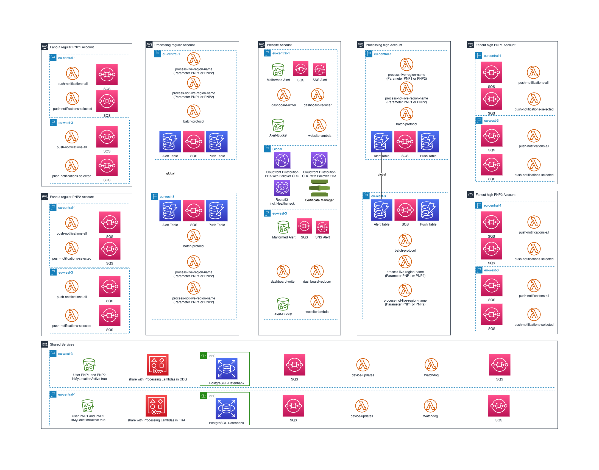

# Multi Region Fanout Platform

This project demonstrates how AWS can be used in serverless highly available active-active multi-region installations. 
It shows how serverless technology can scale almost infinitely and process data in close to real time.
Implemented using AWS CDK, it demonstrates how to work with a combined multi-account & multi-region approach using self mutating CDK pipelines.
The solution is built following AWS best practices and with least privilege in mind and gives an idea how to build distributed components of large serverless applications securely.
The business logic is implemented using an evolutionary hexagonal architecture as described in [this blog post](https://aws.amazon.com/blogs/compute/developing-evolutionary-architecture-with-aws-lambda/), which makes it easy to adapt and re-use it.



## Deployment Instructions
The solution is configured to be deployed across 8 AWS accounts and two regions (eu-central-1 and eu-west-3). The AWS CodePipeline which orchestrates the deployments is supposed to be deployed to an additional "DevOps" account. The workload accounts have to be in an AWS Organizations because we use VPC subnet sharing through AWS Resource Access Manager. We recommend to deploy the Organization into a separate AWS account. Therefore, we recommend to create 10 AWS accounts for a single-stage deployment of this solution:
* 1 AWS Organizations management account
* 1 DevOps account
* 1 website account
* 1 shared services account
* 2 processing accounts
* 4 fanout accounts

### Prerequisites
* Install the [AWS CLI](https://docs.aws.amazon.com/cli/index.html)
* Create and prepare administrator access to in total 10 AWS accounts.
* Create [named profiles](https://docs.aws.amazon.com/cli/latest/userguide/cli-configure-profiles.html) to access each AWS account with administrator permissions
* [Create an organization](https://docs.aws.amazon.com/organizations/latest/userguide/orgs_manage_org.html) in the management account. [Enable AWS Resource Access Manager](https://docs.aws.amazon.com/ram/latest/userguide/getting-started-sharing.html) to share resources within this organization.

### Initial Deployment
1. Pull the repository from GitHub
2. Copy the `.env.sample` file to `.env` and edit it that it contains the 12-digit IDs for your AWS accounts and the corresponding profile names for CLI access
3. Build the code initially
    ```shell
    sh ./build.sh
    ```
   The CDK synthesize step at the end of the build script will return errors because your AWS environments are not yet bootstrapped. These can be ignored.
4. [Bootstrapped](https://docs.aws.amazon.com/cdk/v2/guide/bootstrapping.html) the AWS environments for AWS CDK deployments: 
    ```shell
    sh ./cdk-bootstrap.sh
    ```
   This step will take about 30 minutes when executed for the first time.
5. Deploy the CDK pipeline:
    ```shell
    npm run cdk deploy --all
    ```
   This will create the AWS CodePipeline which is used for all future deployments of the solution. It also creates an empty AWS CodeCommit repository acting as the source for the CodePipeline. Verify with `aws codecommit get-repository --repository-name multi-region-fanout-platform` ("multi-region-fanout-platform" is its default name specified in `cdk.json`).
6. [Connect](https://docs.aws.amazon.com/codecommit/latest/userguide/how-to-connect.html#how-to-connect-local) and push your local repository to the created CodeCommit repository. Depending on your choice of [protocol](https://docs.aws.amazon.com/codecommit/latest/userguide/setting-up.html) to connect you could for example use
    ```shell
    git remote add aws codecommit::eu-central-1://multi-region-fanout-platform
    git push aws release/github_1.0:main
    ```
   This will trigger the CodePipeline and deploy the solution across the individual workload accounts and regions.

Future deployments will be triggered by pushes to the repository. 

The image below illustrates the multiple stacks and deployment groups:


## Smoke Testing
After deployment individual alert messages can be uploaded to the Amazon S3 bucket in the website account triggering their processing in the solution. The individual AWS Lambda functions log to Amazon CloudWatch Logs in the respective AWS accounts and regions. You can check the logs to verify deployment and functionality of the solution.

CLI access to the bucket in the "Website" account provided, alert messages can be uploaded from the command line with
```shell
cd smoketest
sh ./upload.sh <ALERT_ID>
```
This script uploads one alert message from provider "AP2" to the S3 buckets in both regions. The parameter `REGION_HASH` determines in which region the alert message is primarily processed. For example, `0` causes the message to be processed in "eu-central-1", `1` in "eu-west-3". It shall further be noted, that the upload script in its current form uploads one type of alert (provider "AP2", severity "EXTREME") which triggers the processing branch for high criticality. Make sure to adapt the message and the object tags accordingly to test processing in the other region and criticality class.